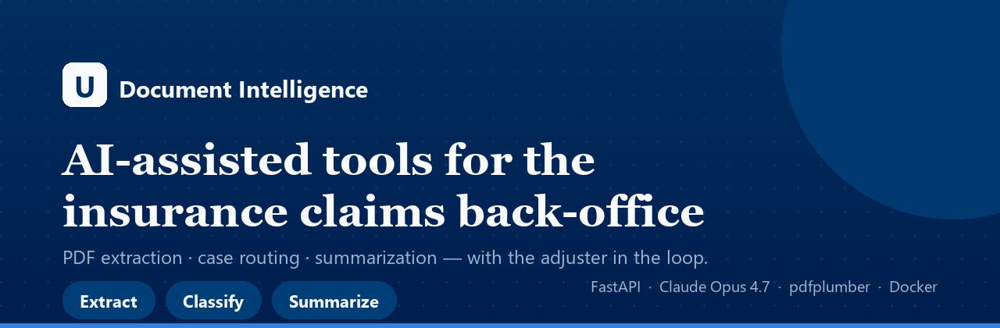
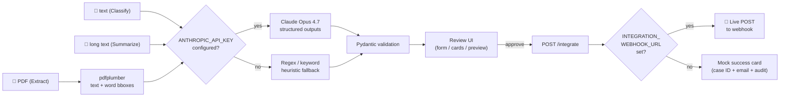

# Document Intelligence for Insurance Claims

> AI-assisted back-office tools for insurance claims workflows.
> Concept demo using UNIQA-style branding. **Not affiliated with or endorsed
> by UNIQA Insurance Group** — used illustratively for portfolio purposes.

### 🟢 Live demo: **<https://document-intelligence-poc.onrender.com>**

[](https://fastapi.tiangolo.com)
[](https://www.anthropic.com)
[](https://render.com)
[](LICENSE)

> *First load may take ~30 seconds — Render free tier sleeps the container
> after 15 minutes of inactivity.*

---

## The business problem

A typical claims adjuster in an insurance back-office spends **5–15 minutes per
case** re-typing data from incoming PDFs and emails into the internal claims
system (TIA, Guidewire, custom systems). At 25 cases per day across a 30-person
team, that's **~75 hours of manual data entry daily** — done by qualified
domain experts who could instead be reviewing complex claims, talking to
customers, or training junior staff.

This demo shows three AI-assisted tools that move that bottleneck:

| Tool | Input | Output | Time saved per case |
|---|---|---|---|
| **Extract** | PDF claim form / invoice | Structured JSON, fields verified against PDF | ~8 minutes |
| **Classify** | Incoming email / message | Category + priority + routing team + actions | ~3 minutes |
| **Summarize** | Long narrative / email thread | Executive summary + key facts + action + reply draft | ~10 minutes |

The adjuster stays in the loop on every case: the AI proposes, the adjuster
confirms (or corrects) before the result is pushed downstream. Missing or
low-confidence fields are surfaced for review in amber.

---

## 60-second self-guided tour

Open the [live demo](https://document-intelligence-poc.onrender.com) and try:

1. **Click "Sample claim form"** — a Slovak car-insurance claim form loads.
   Watch the **PDF preview render on the left** while structured fields
   auto-populate on the right.
2. **Click any field on the right** (e.g. *Policy number*, *Total*, *Bank*) —
   on the PDF preview, the source word(s) get highlighted in yellow. Every
   extracted value can be traced back to its origin on the original document.
3. **Switch to Classify mode** (header nav) and click **Payment complaint** —
   a customer threatening to escalate to the Slovak National Bank loads.
4. **Click Classify case** — notice the **🔴 High priority** badge (the model
   recognises the regulatory escalation language) and the routing to the
   **Billing & Reimbursement** team with concrete suggested actions.
5. **Click Approve & route** — a success card shows the case ID, the team
   mailbox, the audit log, and (if a webhook is configured) confirmation that
   the payload was actually delivered to a downstream system.
6. **Switch to Summarize mode** and click **Disputed claim thread** — a
   multi-message email argument loads. Click **Summarize** to get a 2-3
   sentence executive summary, the key facts, a detected sentiment
   (😠 angry), a suggested action, and a ready-to-edit customer reply.
7. **Watch the *Time saved* counter** in the header grow with each action.

---

## Architecture



### Two run modes — both visible in the UI

| Mode | When | Visual indicator |
|---|---|---|
| **LLM** (`claude-opus-4-7`) | `ANTHROPIC_API_KEY` is set | Green "claude-opus-4-7 extraction" badge |
| **Heuristic** (regex) | No API key | Amber "Heuristic extraction (no API key)" badge |

The heuristic fallback means **the demo works end-to-end without any API
credentials** — anyone can clone the repo and see the full flow. Recruiters
clicking the live URL see the heuristic mode by default; the LLM mode unlocks
when an API key is added.

### Two integration modes — both visible in the UI

| Mode | When | Visual indicator |
|---|---|---|
| **Live webhook** | `INTEGRATION_WEBHOOK_URL` is set | Green "LIVE WEBHOOK" badge + HTTP status |
| **Mock** | No webhook URL | Amber "MOCK" badge — case ID + email are fake |

---

## What's interesting technically

1. **Click-to-highlight source verification** — `pdfplumber` exposes per-word
   bounding boxes; the frontend renders the PDF via `pdf.js` and overlays a
   highlight canvas. Clicking a field in the form finds the matching words on
   the page and draws yellow boxes around them. This is the "decision-support"
   loop in a single interaction.
2. **Strict-schema structured outputs from Claude** — uses
   `output_config.format: json_schema` so the model is constrained to the
   exact Pydantic model the rest of the pipeline expects. No
   prompt-engineering hacks to "please return JSON" — the API enforces it.
3. **Graceful degradation** — every AI call has a deterministic regex fallback.
   The product works without external dependencies and the UI is honest about
   which mode is active.
4. **Three tools, one workspace** — header nav switches between Extract,
   Classify, and Summarize via URL hash (`#extract` / `#classify` /
   `#summarize`). Same backend, same styling, shared time-saved counter,
   shared `/integrate` downstream path.
5. **Real vs mock integration toggle** — toggling `INTEGRATION_WEBHOOK_URL`
   moves the same Approve flow from mock to live POST without code change.
   Lets you demo the same UI as either "works without setup" or
   "production-style pipeline".

---

## Run locally

```powershell
# 1. Install deps (once)
python -m pip install -r requirements.txt

# 2. (Optional) Add API key for the LLM path
copy .env.example .env
# edit .env and set ANTHROPIC_API_KEY=sk-ant-...

# 3. Start the server
.\run.ps1
# or:
python -m uvicorn app.main:app --reload --app-dir .
```

Open <http://127.0.0.1:8000>.

---

## Deploy

The repo ships with a `Dockerfile` and a `render.yaml` blueprint. To deploy
your own copy on Render's free tier:

1. Fork this repo on GitHub.
2. On <https://render.com>, **New → Blueprint** and point at the fork.
3. Render reads `render.yaml`. Add `ANTHROPIC_API_KEY` as a secret env var
   if you want the LLM path — leave empty to deploy in heuristic mode.
4. (Optional) Add `INTEGRATION_WEBHOOK_URL` for the live downstream
   integration demo — see next section.
5. First deploy takes ~3 minutes.

The Docker image runs unchanged on **Fly.io**, **Railway**,
**Google Cloud Run**, or any container host.

### Adding the real downstream integration

For interviews it's powerful to show data actually flowing somewhere — not
just appearing on screen. Set this up once:

1. Open <https://webhook.site> in a new tab. It auto-generates a unique URL.
2. In Render → service → **Environment**, add `INTEGRATION_WEBHOOK_URL`
   with that webhook.site URL as the value. Save.
3. Render redeploys automatically (~30s).
4. Open the demo and the webhook.site tab side by side.
   Click **Approve & route** or **Save & export** — the payload appears in
   webhook.site in real time, the result card shows a green "LIVE WEBHOOK"
   badge with the HTTP status code.

When the env var is not set, both buttons still work — they just show a
"MOCK" badge instead.

---

## Project layout

```
app/
  main.py        FastAPI app, routes, static serving
  extractor.py   Extract orchestration (PDF → LLM or heuristic)
  pdf_reader.py  pdfplumber wrapper, text + per-word bounding boxes
  llm.py         Claude client, JSON schema, heuristic fallback
  classifier.py  Classify orchestration (text → LLM or heuristic)
  summarizer.py  Summarize orchestration (text → LLM or extractive heuristic)
  integration.py Mock + real downstream integration (webhook POST)
  samples.py     Built-in sample messages + claim narratives
  schemas.py     Pydantic models
static/
  index.html     UI shell with mode nav (Extract / Classify / Summarize)
  app.js         Frontend logic + PDF.js + click-to-highlight
  favicon.svg    Document-mark favicon
  style.css      Custom styling
sample-data/
  invoice.pdf      Generic invoice
  claim-form.pdf   Slovak car-insurance claim form (generated)
scripts/
  generate_claim_sample.py  fpdf2 generator for the claim form
  smoke_test.py             End-to-end smoke test against /extract
Dockerfile  · render.yaml  · run.ps1
```

---

## Roadmap to production

What this demo deliberately does **not** include — and what would need to be
added for a real deployment:

- **Authentication** (SSO / OIDC against the company directory) and
  per-adjuster audit log
- **Persisted extractions + reviewer corrections** — corrections are
  high-quality training data for fine-tuning
- **LLM-returned per-field confidence scores** (not just a binary missing
  flag) — needed for "auto-approve if all fields >95%" workflows
- **Batch processing** via the Claude Batches API for end-of-day bulk runs
- **Real downstream integration** with a specific claims system
  (TIA, Guidewire, custom) — currently demonstrated via a configurable
  webhook URL
- **Replace heuristic fallback** with a model-distilled small classifier so
  the no-API-key mode has higher fidelity
- **Multi-page PDF support** is implemented; multi-document batch upload UI
  would be ~1 day

---

## License

MIT — see [LICENSE](LICENSE). The UNIQA name, logo, and brand colours are
property of UNIQA Insurance Group. This is an independent portfolio project
not affiliated with UNIQA.
